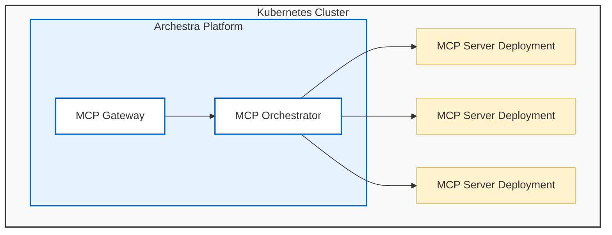

<!--
Check ../docs_writer_prompt.md before changing this file.

This document is human-built, shouldn't be updated with AI. Don't change anything here.

Exception:
- Screenshot
-->

The MCP Orchestrator runs self-hosted MCP servers inside your Kubernetes cluster. It creates the deployment, injects configuration and secrets, exposes logs and status in Archestra, and connects those servers to Agents and MCP Gateways.

The orchestrator is only needed for MCP servers that Archestra hosts. Remote MCP servers can still be managed in the [Private MCP Registry](/docs/platform-private-registry) and exposed through [MCP Gateways](/docs/platform-mcp-gateway) without creating Kubernetes deployments.

## Runtime Model

Each self-hosted MCP server runs as its own Kubernetes deployment. That gives each server an isolated process, restart lifecycle, environment, image, and network boundary.

When a server is installed from the registry, Archestra creates or updates the deployment for that installation. Gateway traffic is routed to the deployment when a tool assigned from that installation runs.

The orchestrator also surfaces server status, container logs, and restart controls so operators do not need to leave Archestra for common MCP runtime tasks.

## Server Configuration

Self-hosted registry entries define how the deployment should be built.

- **Base image with command and args**: use Archestra's MCP server base image and specify the command to run.
- **Custom image**: provide your own Docker image when the server is packaged as a container.
- **Environment and secrets**: define install-time fields, static environment variables, and secret values needed by the server.
- **Advanced YAML**: override the generated Kubernetes deployment when you need custom pod configuration.

Registry entries define whether a server is remote or self-hosted before the orchestrator creates any Kubernetes resources. See [Private MCP Registry - Server Configuration](/docs/platform-private-registry#server-configuration) for those registry fields.

## Transports

Self-hosted servers support two transports:

- **stdio**: Archestra runs the server process and communicates over standard input/output. This is the default for many local MCP servers.
- **streamable-http**: Archestra exposes the server through an internal Kubernetes service and communicates over HTTP. Use this when the server needs concurrent requests, downstream HTTP headers, or per-request credential injection.

Stdio is simple and works well for process-oriented servers. Streamable-http is the better fit when the server behaves like a normal HTTP service or needs request-specific identity.

## Image Pull Secrets

If a custom MCP server image is stored in a private container registry, configure image pull secrets so Kubernetes can authenticate when pulling it.

Archestra supports two patterns:

- **Existing Kubernetes secret**: select a preexisting `kubernetes.io/dockerconfigjson` secret from the Archestra platform namespace.
- **Provided registry credentials**: enter the registry server, username, and password, and Archestra creates the Docker registry secret.

Multiple image pull secrets can be configured for one server.

## Scheduling Defaults

If `tolerations` or `nodeSelector` are configured in the Helm values for the Archestra platform pod, those values are automatically inherited as defaults by all self-hosted MCP server deployments. This ensures MCP servers are scheduled on the same node pool as the platform without additional configuration.

These defaults can be overridden per-server via the advanced YAML config. See [Service, Deployment, & Ingress Configuration](/docs/platform-deployment#service-deployment--ingress-configuration) for the relevant Helm values.

## Credentials

The orchestrator injects the configuration and secrets required by self-hosted MCP servers. These values come from the installed server connection, not from the MCP client.

For stdio servers, credentials are usually provided as environment variables or secrets in the deployment. For streamable-http servers, Archestra can also inject request-specific HTTP credentials when the tool assignment uses dynamic credential resolution.

See [MCP Authentication](/docs/mcp-authentication#upstream-mcp-server-authentication) for credential resolution, OAuth refresh, and enterprise IdP token exchange.
